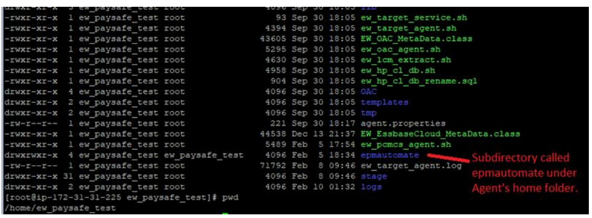
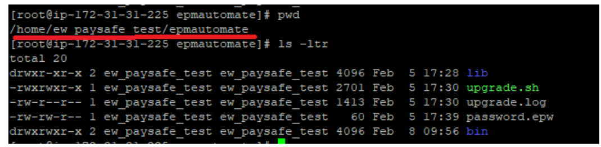

# PCMCS

There are two options to connect to PCMCS applications using the EPMware Agent. The
EPMware agent can either be installed on the EPMware supplied cloud server on AWS
or on a customer supplied server. If an EPMWARE supplied cloud server is used then no
action is required. However, it is possible that Oracle may either block communication
initiated from the AWS server and therefore customers may choose to use their own
server to communicate with the PCMCS application.


## EPMAUTOMATE

Create a subdirectory called “epmautomate” as shown below under the Agent’s home
directory.

For example, in this case the agent's home directory is `“home/ew_paysafe_test”`

<br/> 


The directory contents of the EPMAUTOMATE utility should look like the following:

<br/> 

<b>Tasks performed by the Agent : </b>

The EPMware Agent will communicate with the EPMware application and check every 30
seconds to see if there are any deployments in the queue. Any pending deployments will
be processed and return a status and log details back to the EPMware application. The
EPMware Agent will use the EPMAUTOMATE utility to deploy metadata to the PCMCS
application. Therefore, the EPMAUTOMATE utility will need to be pre-installed at a
specific location as mentioned below.

**Agent Maintenance**

There are two types of updates that may be periodically needed for the EPMware agent.

1. The EPMware agent is updated. In this case EPMware will communicate this in
the monthly release email.
2. Oracle updates the EPMAUTOMATE utility. The client will need to update the
EPMAUTOMATE utility in their environment. The utility can be easily updated by
issuing the “epmautomate upgrade” command.


**Test connectivity to PCMCS application using EPMAUTOMATE**

Perform the following steps after installing the `epmautomate` utility under the EPMware agent directory to ensure EPMAUTOMATE is able to connect to the PCMCS application successfully.

Navigate to the `epmautomate/bin` folder and issue the command as shown below:


` ./epmautomate login <PCMCS_username> <password> <PCMCS App URL>`


**For Example**

### Example

` ./epmautomate login svc_ew_user welcome123 https://pcmcs-testa123456.epm.em3.oraclecloud.com `


The Command should provide a “Login successful” message back to the prompt.

If the epmautomate utility needs an upgrade then it will show the following message:

**Note: A new version of EPM Automate is available. You can use "upgrade" command to install.**

## Upgrade EPMAUTOMATE utility

EPMAUTOMATE utility can easily be upgraded using the commands shown below.

For more details, please refer to Oracle’s standard documentation.

```bash
./epmautomate login svc_ew_user welcome123 https://pcmcs-testa123456.epm.em3.oraclecloud.com
./epmautomate.sh upgrade
```