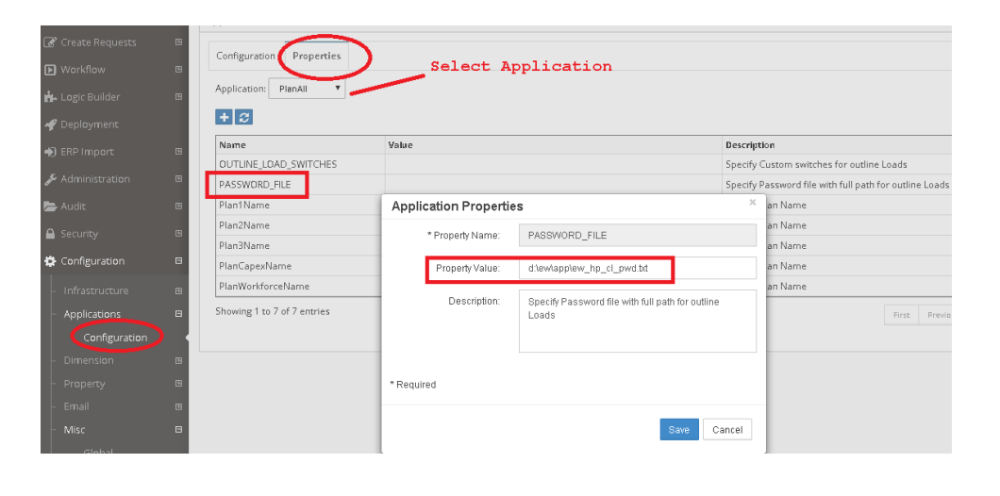

# Hyperion Planning 

This section is needed only if you have an On Premise Oracle Planning application where
EPMWARE agent is installed.


**Generate encrypted password for the planning application user.**

EPMWARE will need a password file that holds the encrypted password of the
application user. Using this file EPMWARE will be able to deploy metadata to the
Planning application.

Location of this encrypted file will be specified in the Application Properties page in
EPMWARE.

**Encrypted password generation is documented in Oracle Planning Guide. For more details, please refer to Oracle documentation. Steps mentioned below are for reference only.**

- Logon to the Planning server. In this example we will assume it is a Windows server and Oracle is installed on the D drive.  

- Navigate to the folder:  
  `D:\Oracle\Middleware\user_projects\epmsystem1\Planning\planning1`

- Run `PasswordEncryption.cmd <passwordFile>`  
  (specify password file with full path. If file path is not specified then file is generated at the location where this command is run)  

  For example:  
  `PasswordEncryption.cmd ew_hp_cl_pwd.txt`
  
  
``` 
D:\Oracle\Middleware\user_projects\epmsystem1\Planning\planning1>PasswordEncryptiond:\ew\app\ew_hp_cl_pwd.txt
Enter password to encrypt:
Password has been encrypted and written to the file d:\ew\app\ew_hp_cl_pwd.txt
successfully!


```


- Login to the EPMWARE application and navigate to the Configuration -> Applications menu.
- Specify the filename with full path in the target application parameter as shown below. Select application from LOV, select PASSWORD_FILE from the grid and
right click Edit Properties to change property value.

<br/>


