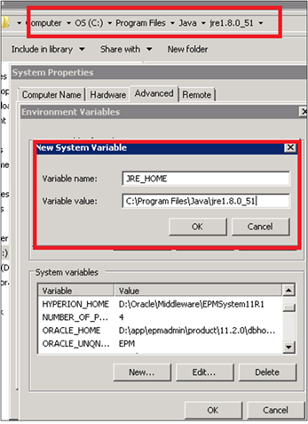

# EPMware Application

This section covers the deployment and configuration of the EPMware application on the Tomcat server.

## Overview

The EPMware application is deployed as a WAR (Web Application Archive) file on the Apache Tomcat server. After deployment, you'll need to configure database connections, application settings, and verify the installation.

## Prerequisites

Before deploying the EPMware application, ensure:

- [ ] Apache Tomcat is installed and running
- [ ] Java and Jython are properly configured
- [ ] Database is installed with EPMware schema
- [ ] Network connectivity to database is verified
- [ ] EPMware WAR file (epmware.war) is available
- [ ] Administrative access to Tomcat server

## WAR File Deployment

### Deploy EPMware Application

#### Linux Deployment

```bash
# Stop Tomcat
sudo systemctl stop tomcat
# OR
/opt/tomcat/bin/shutdown.sh

# Copy WAR file to webapps directory
sudo cp epmware.war /opt/tomcat/webapps/
sudo chown epmware:epmware /opt/tomcat/webapps/epmware.war

# Start Tomcat
sudo systemctl start tomcat
# OR
/opt/tomcat/bin/startup.sh

# Monitor deployment
tail -f /opt/tomcat/logs/catalina.out
```

#### Windows Deployment

```batch
:: Stop Tomcat service
net stop EPMware

:: Copy WAR file to webapps directory
copy epmware.war D:\apache-tomcat\webapps\

:: Start Tomcat service
net start EPMware

:: Monitor deployment
type D:\apache-tomcat\logs\catalina.out
```

### Verify Deployment

After deployment, Tomcat will automatically extract the WAR file:

1. Check that the `epmware` directory is created in webapps
2. Verify no errors in catalina.out log
3. Access the application: `http://server:8080/epmware`

!!! note "First-Time Deployment"
    The first deployment may take 2-3 minutes as Tomcat extracts and initializes the application.

## JDBC Configuration

### Configure Database Connection

After the WAR file is deployed and extracted, configure the database connection:

#### Stop Tomcat

```bash
# Linux
sudo systemctl stop tomcat

# Windows
net stop EPMware
```

#### Edit Configuration File

Navigate to the configuration directory:
- Linux: `/opt/tomcat/webapps/epmware/WEB-INF/classes/`
- Windows: `D:\apache-tomcat\webapps\epmware\WEB-INF\classes\`

Edit or create `fs_custom.properties`:

```properties
#JDBC Configuration
jdbc.driver=oracle.jdbc.driver.OracleDriver
jdbc.url=jdbc:oracle:thin:@//dbserver.company.com:1521/epm
jdbc.user=ew
jdbc.password=yourpassword
jdbc.maxPoolSize=40
jdbc.minPoolSize=5
jdbc.initialPoolSize=5
jdbc.maxIdleTime=300
jdbc.maxStatements=200
jdbc.preferredTestQuery=select 1 from dual
jdbc.idleConnectionTestPeriod=60

# Connection pool settings
jdbc.acquireIncrement=3
jdbc.acquireRetryAttempts=30
jdbc.acquireRetryDelay=1000
jdbc.checkoutTimeout=0
jdbc.numHelperThreads=10
```

### Connection String Formats

Different Oracle connection string formats:

```properties
# Service Name format (recommended)
jdbc.url=jdbc:oracle:thin:@//hostname:1521/servicename

# SID format
jdbc.url=jdbc:oracle:thin:@hostname:1521:SID

# TNS format
jdbc.url=jdbc:oracle:thin:@(DESCRIPTION=(ADDRESS=(PROTOCOL=TCP)(HOST=hostname)(PORT=1521))(CONNECT_DATA=(SERVICE_NAME=servicename)))

# RAC connection
jdbc.url=jdbc:oracle:thin:@(DESCRIPTION=(ADDRESS_LIST=(ADDRESS=(PROTOCOL=TCP)(HOST=node1)(PORT=1521))(ADDRESS=(PROTOCOL=TCP)(HOST=node2)(PORT=1521)))(CONNECT_DATA=(SERVICE_NAME=servicename)))
```

### Test Database Connection

After configuring JDBC:

```bash
# Restart Tomcat
# Linux
sudo systemctl restart tomcat

# Windows
net stop EPMware
net start EPMware
```

Check logs for successful database connection:
```bash
grep -i "database connection successful" /opt/tomcat/logs/epmware.log
```

## Windows System Environment Variables

### Configure JRE_HOME

For Windows installations, set system environment variables:

1. **Open System Properties:**
   - Control Panel → System → Advanced System Settings
   - Click "Environment Variables"

2. **Create JRE_HOME Variable:**
   - Click "New" under System Variables
   - Variable name: `JRE_HOME`
   - Variable value: `C:\Program Files\Java\jre1.8.0_xxx`

3. **Verify Configuration:**
   ```batch
   echo %JRE_HOME%
   ```
<br/>
*JRE System Variable*

## Application Directory Structure

After deployment, the EPMware application creates the following structure:

```
webapps/epmware/
├── WEB-INF/
│   ├── classes/
│   │   ├── fs_custom.properties
│   │   ├── log4j.properties
│   │   └── application.properties
│   ├── lib/
│   │   └── [JAR files]
│   └── web.xml
├── META-INF/
├── resources/
├── static/
└── index.jsp
```

## Initial Application Access

### First-Time Login

1. **Access the Application:**
   ```
   http://server:8080/epmware
   ```

2. **Default Credentials:**
   - Username: `admin`
   - Password: `admin123` (change immediately)

3. **Initial Setup Wizard:**
   - Configure admin email
   - Set timezone
   - Configure email server
   - Set up first application connection

### Security Considerations

**Immediate Security Steps:**

1. **Change Default Password:**
   - Navigate to User Profile
   - Change password with complexity requirements
   - Minimum 8 characters
   - Include uppercase, lowercase, numbers, special characters

2. **Configure Session Timeout:**
   Edit `web.xml`:
   ```xml
   <session-config>
       <session-timeout>30</session-timeout>
   </session-config>
   ```

3. **Enable HTTPS:**
   - Configure SSL certificate in Tomcat
   - Force HTTPS redirect
   - Update application URLs

## Application Properties

### Core Application Properties

Edit `application.properties` for advanced configuration:

```properties
# Application Settings
app.name=EPMware
app.version=6.6
app.environment=PRODUCTION

# File Upload Settings
upload.max.size=104857600
upload.temp.dir=/opt/epmware/temp

# Session Management
session.timeout=1800
session.concurrent.max=100

# Logging
logging.level=INFO
logging.file=/opt/epmware/logs/epmware.log
logging.max.size=100MB
logging.max.history=30

# Cache Settings
cache.enabled=true
cache.size=1000
cache.ttl=3600

# Scheduler
scheduler.enabled=true
scheduler.thread.pool=10
```

## Logging Configuration

### Configure Log4j

Edit `log4j.properties`:

```properties
# Root Logger
log4j.rootLogger=INFO, file, console

# Console Appender
log4j.appender.console=org.apache.log4j.ConsoleAppender
log4j.appender.console.Target=System.out
log4j.appender.console.layout=org.apache.log4j.PatternLayout
log4j.appender.console.layout.ConversionPattern=%d{yyyy-MM-dd HH:mm:ss} %-5p %c{1}:%L - %m%n

# File Appender
log4j.appender.file=org.apache.log4j.RollingFileAppender
log4j.appender.file.File=/opt/epmware/logs/epmware.log
log4j.appender.file.MaxFileSize=100MB
log4j.appender.file.MaxBackupIndex=30
log4j.appender.file.layout=org.apache.log4j.PatternLayout
log4j.appender.file.layout.ConversionPattern=%d{yyyy-MM-dd HH:mm:ss} %-5p %c{1}:%L - %m%n

# Application Specific Loggers
log4j.logger.com.epmware=DEBUG
log4j.logger.org.springframework=INFO
log4j.logger.org.hibernate=WARN
```

## Performance Optimization

### JVM Heap Monitoring

Enable JMX monitoring for heap analysis:

```bash
# Add to setenv.sh or setenv.bat
CATALINA_OPTS="$CATALINA_OPTS -Dcom.sun.management.jmxremote"
CATALINA_OPTS="$CATALINA_OPTS -Dcom.sun.management.jmxremote.port=9090"
CATALINA_OPTS="$CATALINA_OPTS -Dcom.sun.management.jmxremote.ssl=false"
CATALINA_OPTS="$CATALINA_OPTS -Dcom.sun.management.jmxremote.authenticate=false"
```

### Database Connection Pool Tuning

Optimize based on load:

```properties
# High-load environment
jdbc.maxPoolSize=100
jdbc.minPoolSize=20
jdbc.initialPoolSize=20
jdbc.acquireIncrement=5

# Low-load environment  
jdbc.maxPoolSize=20
jdbc.minPoolSize=5
jdbc.initialPoolSize=5
jdbc.acquireIncrement=2
```

## Troubleshooting Deployment

### Common Issues

**WAR file not deploying:**
- Check Tomcat logs for errors
- Verify file permissions
- Ensure sufficient disk space
- Check for port conflicts

**Database connection failures:**
- Verify JDBC URL format
- Test database connectivity
- Check firewall rules
- Verify credentials

**Out of memory errors:**
- Increase heap size in setenv script
- Check for memory leaks
- Monitor heap usage

**Application not accessible:**
- Verify Tomcat is running
- Check firewall rules
- Confirm port configuration
- Review application logs

### Log Locations

Check these logs for troubleshooting:

| Log File | Location | Purpose |
|----------|----------|---------|
| catalina.out | tomcat/logs/ | Tomcat startup/runtime |
| epmware.log | epmware/logs/ | Application logs |
| localhost.log | tomcat/logs/ | Host-specific logs |
| access.log | tomcat/logs/ | HTTP access logs |

## Validation Checklist

Complete deployment validation:

- [ ] WAR file deployed successfully
- [ ] Application accessible via browser
- [ ] Database connection established
- [ ] Admin login successful
- [ ] Email configuration tested
- [ ] Logs showing no errors
- [ ] Memory settings appropriate
- [ ] Security settings configured

## Next Steps

After successful deployment:

1. Configure [Application Settings](settings.md)
2. Set up [Target Applications](../targets/)
3. Install [EPMware Agents](../agent/)
4. Complete [Post-Installation](../post-install/) tasks

!!! success "Deployment Complete"
    Once the application is deployed and configured, proceed with application-specific settings.

---

© 2025 EPMware, Inc. All rights reserved.
