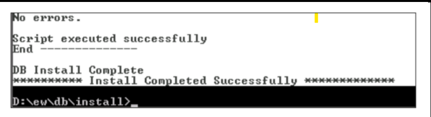

# Install Database Objects

This section covers the installation of EPMware database objects including tables, indexes, stored procedures, and other schema objects.

## Prerequisites

Before installing database objects, ensure:

- Oracle EMPWARE Schema is already created with all necessary grants
- Oracle client is installed on the machine from where Database Objects are being
created. This machine does not necessarily have to be EPMWARE server. It can
be any machine from where Database where EPMWARE schema is installed is
accessible.
- Oracle database connection entry is available in TNSNAMES.ora file. To test the
database connectivity, use SQLPLUS (Oracle Client).
- Jython (Latest version) is already installed and its location is in the PATH. (For
windows add location of jython’s home directory in the path).

## Install EPMWARE Schema

1. Copy the database schema install zip file (*ew_db_install.zip*) to the database
   server (OR on a server which has a database client and can connect to
   EPMWARE Database).
2. Unzip the file
3. Run `*ew_install.bat*` for windows and `*ew_install.sh*` for Unix Operating systems.
   This script will expect three mandatory and two optional parameters.
   
     1. Database Schema Name (For example EW)
     2. Schema Password
     3. Database sid (As configured in tnsnames.ora file of the database client)
     4. Delete Objects Y/N - Default N (In case you want to delete all
        EPMWARE objects and reinstall all objects from scratch.)
     5. Resume Y/N - Default N (Pass Y to resume from the prior failed
        installation step)

4. Result of the batch file will be as shown below.

    
5. Check the ew_driver.log log file for any errors.

