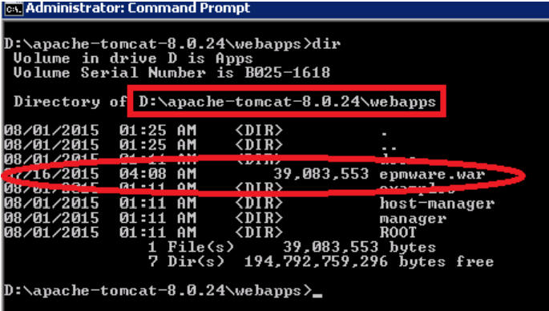
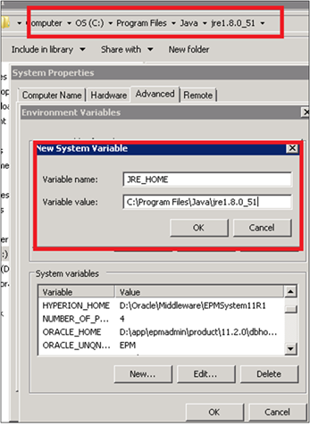

# Install the EPMware Application

## EPMWARE Application WAR file

Copy `epmware.war` file to `<apache>\webapps`  folder.

 

## Windows System Environment Variable

**Setup environment variable for JRE_HOME**

1. Locate folder where JRE is installed.
2. Go to Control Panel→ System→Security\System , select Advanced System Settings.
3. Select Environment Variables button
4. Create New System Variable for JRE_HOME as shown below.

 

## Next Steps

Once you have reviewed this getting started section and completed the prerequisites:

1. [Register Apache As The Windowss Service](reg_apache_as_windows_service.md)

